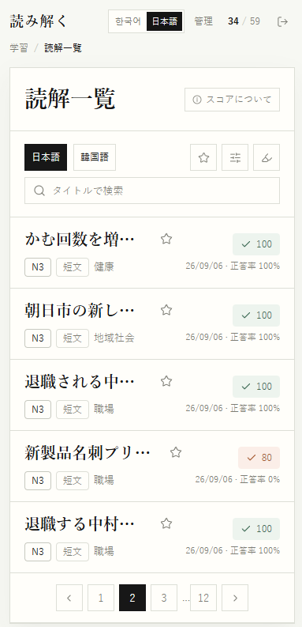
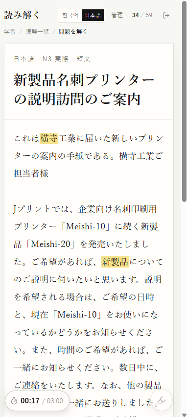
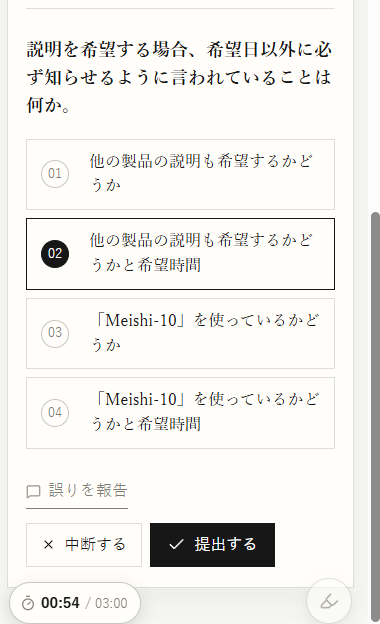
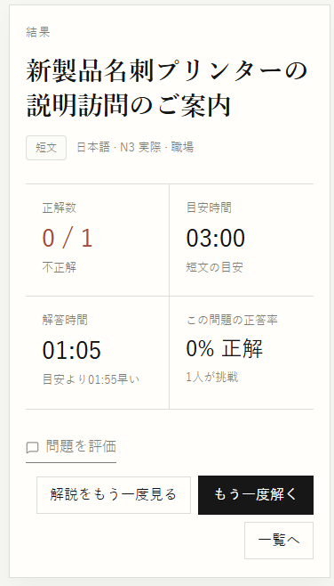
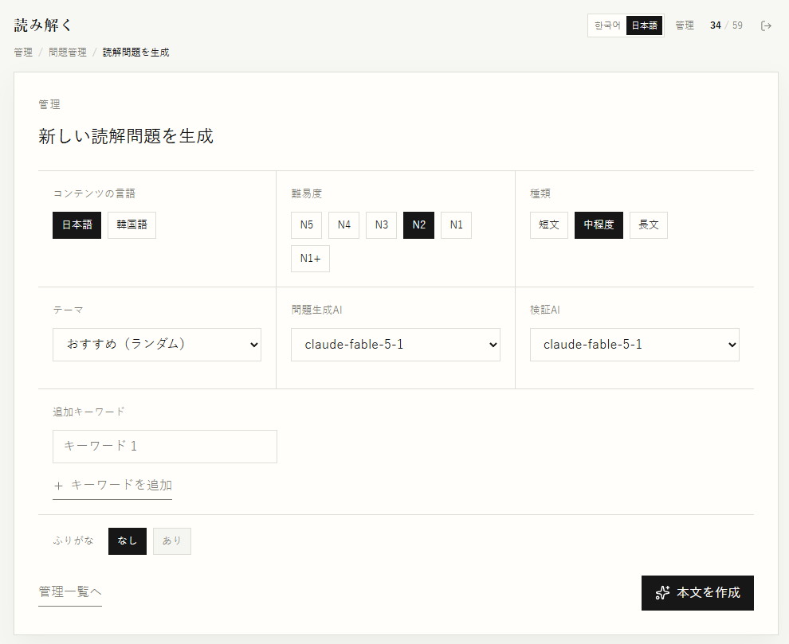
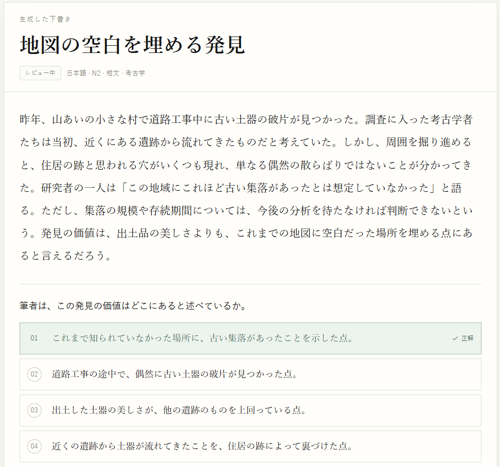

# 読み解く：プロジェクト概要と設計判断

> AIとの協働によるフルスタック開発 · 最終検証日: 2026-09-20

## 概要

| 項目 | 内容 |
| --- | --- |
| プロダクト | 日本語・韓国語の読解学習とコンテンツ運用をつなぐWebサービス |
| 利用者 | 読解を継続的に学習する受講者、問題を生成・レビュー・公開する管理者 |
| 主な課題 | 問題検索、長文読解、結果の復習、次の学習、コンテンツ品質管理が分断されること |
| 技術 | React・TypeScript・Vite、FastAPI、PostgreSQL、Alembic、Docker Compose、LangGraph |
| AIの活用 | 実装の下書き、反復作業、テスト、文書化をAIエージェントと協働し、要件、受け入れ基準、レビュー、最終判断はプロジェクト所有者が担う方式 |

## プロダクトフロー

```text
受講者
  ログイン → 条件に合う問題を検索 → 解答を開始 → 設問ごとのフィードバック → 次の未回答問題／復習

管理者
  手動登録またはAI生成タスク → スキーマ・正答・品質の検証 → レビュー → 公開
```

AI生成の結果は、検証を通過しても自動公開されません。コストが発生する生成処理は別タスクとして実行し、失敗、再試行、利用量、検証の根拠を記録します。

## 主な画面

受講者向け画面は幅375pxの実際のモバイル画面例で、管理者によるコンテンツ生成・レビュー画面はデスクトップ画面例です。個人を特定できる情報や運用データは含めていません。

### 受講者フロー（モバイル）

#### 問題の検索

言語タブ、検索、フィルター、ブックマーク、ページネーションで、現在の学習条件に合う問題を探します。



#### 本文の読解と根拠の確認

本文を読みながら経過時間を確認し、必要な文章をハイライトとして残せます。



#### 解答の選択と提出

選択肢は問題ごとに並び替えられ、キーボードとタッチのどちらでも選んで提出できます。



#### 結果と次の行動

正答数、目安時間と実際の時間、正答率を確認し、解説の復習または次の学習へ進みます。



### 管理者によるコンテンツ生成とレビュー（デスクトップ）

管理者はコンテンツ言語、難易度、種類、テーマ、キーワード、生成・検証モデルを設定して問題生成タスクを開始します。生成結果は自動公開せず、検証と管理者レビューを行います。



生成結果は下書きとして開き、本文、設問、正答を確認します。



管理者は解説の根拠を確認してから、保留または公開を選びます。


## システム構成

```text
Browser (React / GitHub Pages)
  ├─ sessionStorage: ログイントークン、現在の試行ID、選択した解答
  └─ HTTPS Bearer API
       └─ FastAPI
            ├─ PostgreSQL: 問題、試行、解答、学習記録、生成タスク
            └─ Worker (LangGraph): 生成 → スキーマ検証 → 正答・品質検証 → レビュー待ち
                 └─ Stub provider または Anthropic provider
```

権限はクライアントUIではなく、サーバートークンと管理者allowlistで判定します。APIキーとJWTシークレットはフロントエンドに置きません。

## 課題を実装へ落とし込んだ例

### 1. 素早く検索しても最新結果だけを表示する

検索語が変わるたびにリクエストすると、不要なネットワークコストが発生し、遅い古い応答が最新結果を上書きするおそれがあります。問題一覧と管理者検索に300msのデバウンスを適用し、新しいリクエスト開始時に前の`AbortController`リクエストをキャンセルしました。通常のAPIリクエストには15秒の制限時間を設けています。

### 2. 解答中の再読み込みでも学習フローを失わない

現在の試行IDと選択した解答をタブセッションに保持し、解答・結果ルートへ入る際にサーバーの試行状態を再取得します。これにより、同じブラウザタブで再読み込みしても進行中の解答と提出結果を復元します。保存済みの試行がない、またはユーザーが一致しないルートでは、空白画面ではなく一覧へ移動します。

この選択は、URLだけで他者と学習記録を共有しないというセキュリティと個人化の原則に従っています。長期的な複数端末同期は、別のプロダクト要件とサーバーAPIが必要な今後の課題です。

### 3. 結果を終点ではなく次の学習の起点にする

部分正解を単なる「不正解」とだけ見せないため、正答数を結果画面の主情報として表示しました。正答後には、現在の検索語、言語、レベル、種類、ブックマーク条件全体から未回答の問題を取得します。対象がなくなった場合は完了案内と一覧への復帰を示し、現在ページの問題を循環して再提示することを防ぎます。

### 4. 繰り返す操作と編集時のデータ損失を減らす

ブックマークは確認ダイアログを経由せず即時に反映し、トーストから取り消せます。一方、管理者の編集・手動登録では、タイトル、本文、目安時間、すべての設問・選択肢・解説を比較し、実際に変更がある場合のみ離脱確認を表示します。目安時間は秒数の自由入力ではなく、`1分`、`1分30秒`、`2分`のような読みやすい選択肢に変更しました。

### 5. キーボードだけでも最後まで完了できるようにする

ダイアログを開くと最初の操作要素へフォーカスを移し、Tabキーをダイアログ内で循環させます。閉じると実行ボタンへフォーカスを戻します。解答はラジオグループとして実装し、方向キーとHome／Endキーで移動・選択できます。

## AIとの協働方法と責任範囲

AIの出力をそのまま信頼するのではなく、以下の反復プロセスで活用しました。

1. プロジェクト所有者が、ユーザー課題、完了基準、変更範囲を明確にする。
2. AIエージェントが、関連コードを調査し、実装・テスト・文書の下書きを提案する。
3. プロジェクト所有者が、動作、権限境界、データ損失の可能性、UXポリシーをレビューし、修正方針を決める。
4. 変更後に、型検査、単体・コンポーネントテスト、プロダクションビルド、文書の整合性を確認する。

外部への紹介や面接では、このリポジトリで実際に説明・再現できる判断だけを自身の役割として説明します。AIの関与を隠したり、すべてを手作業で書いたと主張したりしません。

## 検証の根拠

- 2026-09-20時点の`npm test`: 16テストファイル、24テストが成功
- 同日時点の`npm run build`: TypeScript検査とViteのプロダクションビルドが成功
- 回帰テストには、検索デバウンス、トーストの取り消し、目安時間の選択、選択肢の方向キー操作、ダイアログのフォーカス循環・復帰、試行解答の保存が含まれます。
- 画面、API、デバイスごとの手動確認項目は[QAチェックリスト](./04-acceptance-checklist.md)で分けて管理しています。

初期画面のJavaScriptエントリチャンクは、最後のローカルビルドでgzip圧縮後およそ89.8kBでした。この値はライブラリやバンドラーの変更で変わる参考測定値であり、性能目標や運用指標の代替ではありません。

## 既知の制約と今後の検証

- 解答・結果の復元は、同じブラウザタブ内の有効なログインセッションに限られます。
- 実際のGoogleログイン、運用API、iPhone Safari・Android Chromeのエンドツーエンド検証は、まだチェックリストの段階です。
- CIは、PRでのバックエンド検査（Ruff・pytest・Compose）とフロントエンド検査（テスト・ビルド）、`main`デプロイ時のフロントエンドビルドで構成されています。
- ユーザー観察や学習成果の運用指標はまだ収集していません。次の段階では、「条件に合う未回答問題を探す」「誤答の解説を探す」「長文で未回答の設問を探す」際の完了時間とつまずき箇所を測定します。

## 関連ドキュメント

- [UI・フロー仕様](./01-ui-and-flow-spec.md)
- [データ・API仕様](./02-data-and-api-spec.md)
- [AI生成アーキテクチャ](./03-ai-generation-architecture.md)
- [QAチェックリスト](./04-acceptance-checklist.md)
- [本番デプロイガイド](./06-production-deployment.md)
